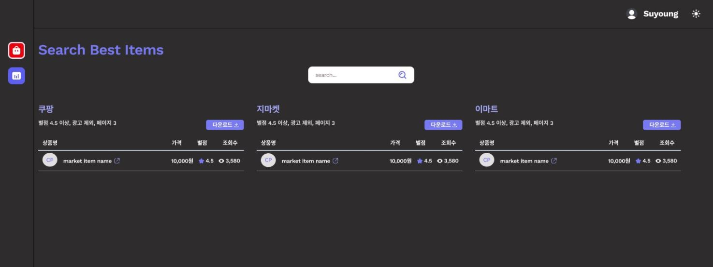

개인사로 너무 바빠서 건강만 챙겨도 성공할 것만 같았던 한 해가 지나갔다.  
그럼에도 그 사이사이에 많은 일들을 해낸 것 같아 결론적으론 뿌듯한 마음을 안고 2022년을 맞이했다.

### ✨ 2021 초창기 목표

- [x] 엘리의 React 강의 듣기 (100%)
- [x] 사이드 프로젝트 (50%)
- [x] 방통대 1,2학기 완료 (100%)
- [x] 정보처리기사 자격증 따기 (100%)
- [x] 운동 시작하기 (50%)
- [ ] 책 읽는 습관 기르기 (10%)
- [ ] 영어 공부 꾸준히 하기 (10%)
- [x] 팀 내부 프론트 디자인 컨벤션 만들기 (50%)
- [ ] 토끼 친구 1.6키로 만들기 (30%)

#### 🔹 공부 방향성 회고

`기본 다지기`, `새로운 것 배우기` 작년엔 두 키워드를 중심으로 공부 방향을 잡았다.
우선 업무적으로 내가 사용하고 있는 React.js에 집중했고 유명한 현업 개발자는 어떤
식으로 코드를 짜는지에 포커스를 맞춰서 강의를 들었다. 그리고 작년초부터 챙겨보고
싶었던 Typescript를 입혀서 내 나름의 추가 버전으로 코드를 따라쳤다. 나는 강의 중심형
학습을 선호하는 타입이라 이런 방식의 학습이 편하고 재밌다고 느꼈는데 성장에 있어선
한계가 있음을 깨달았다.

- 강의형 학습은 새로운 스킬, 혹은 이론 중심이 아니면 선택하지 않을 것 같다
- 라이브러리를 걷어내고 순수 바닐라 js에서 상태관리가 어떻게 이루어지는지를 이해하는 것이 중요할 것 같다

`새로운 것 배우기` 키워드에서는 Python을 골랐다. 이유는 쓸 줄 아는 언어의 폭을 조금 더 넓히고 싶기도 했고 팀 내부에서 채택된 언어이기도 했고 쉽다는 말에 혹한 것도 있었다. 간단하게 이것만 만들어봐야지 했던 작은 토이 프로젝트에 다른 기능의 페이지들을 추가하고 디자인하고 기획하면서 규모가 살짝 커져버려서 그냥 2022년 상반기 사이드 프로젝트로 결정했다.

- 지마켓, 쿠팡, 이마트에서 상품판매량 순으로 검색어에 따른 결과값을 크롤링하는 사이드 프로젝트를 만들었다.
- RestAPI를 만들어 데이터베이스를 이용해 토끼친구 체중관리하는 페이지를 만들었다.
- 파이썬 파일들은 어떤 구조로 관리되는지 궁금증이 생겼다.
- 작년 초에 백엔드 개발자와 협업하면서 생겨난 이슈들을 똑같이 겪으면서 신기함+기록 욕구가 증가했다.

#### 🔹 업무 방향성 회고

#### 🔹 삶의 패턴 방향성 회고
