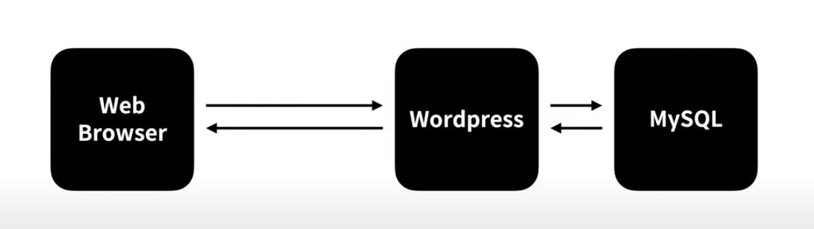
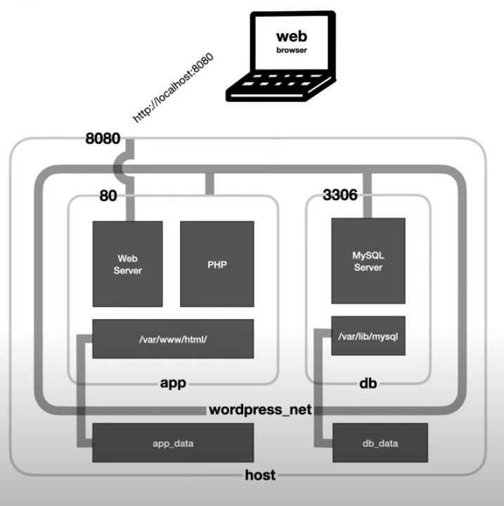
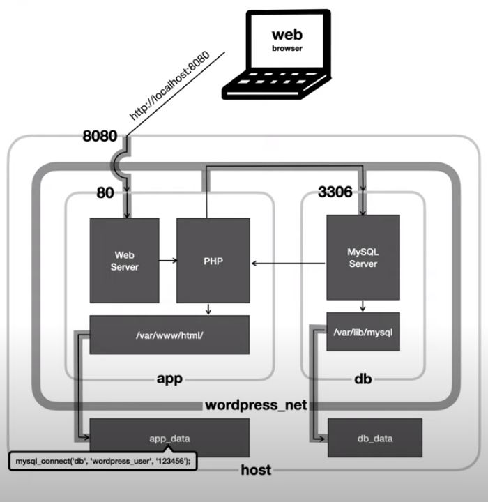

도커 컴포즈가 무엇인지 궁금해 다시 생활코딩을 찾아갔다.  
도커 컴포즈는 쉽게 말하면 shell에서 치는 복잡한 설치 명령어들을 파일 하나에 담아

```
docker-compose up
```

이 한줄로 설치를 완료시키는 기능을 해주는 패키지 파일이다.  
해당 강의는 설치형 블로그인 워드프레스를 이용해 예시를 들어 설명해 준다.

### 예시 시나리오

아래와 같은 환경을 도커를 이용해 워드프레스를 만든다고 가정하자.  
워드프레스 컨테이너가 존재하고 mysql 컨테이너가 존재할 것이다. 그리고 웹브라우저를 통해 워드프레스에 접근하면 워드프레스에 연결된 mysql에서 특정 작업을 처리하고 그 결과를 워드프레스에게 가져온 뒤 다시 웹브라우저에게 응답할 것이다.



### shell로 설치

도커 컴포즈가 없다면 아래와 같은 설치 명령어를 사용해 위 시나리오 환경을 구성할 수 있을 것이다.

1. wordpress_net이라는 도커 네트워크 설치

   ```shell
   docker network create wordpress_net
   ```

   - app 컨테이너와 db 컨테이너는 서로 정보를 주고 받을 네트워크가 필요하다
   - wordpress_net을 설치하면 app 컨테이너와 db 컨테이너의 호스트를 ip가 아닌 이름으로 사용 가능하게 해준다

2. db 컨테이너 설치

   ```shell
   docker \
   run \
       --name "db" \
       -v "$(pwd)/db_data:/var/lib/mysql" \
       -e "MYSQL_ROOT_PASSWORD=123456" \
       -e "MYSQL_DATABASE=wordpress" \
       -e "MYSQL_USER=wordpress_user" \
       -e "MYSQL_PASSWORD=123456" \
       --network wordpress_net \
   mysql:5.7

   ```

   - db라는 이름의 컨테이너가 생성되고 호스트의 $(현재 위치)/db_data 폴더와 컨테이너의 /var/lib/mysql 폴더를 연결한 뒤 mysql 접속을 위한 정보들을 환경변수를 이용해 적어준다. 그리고 앞서 설치한 도커 네트워크로 만든 wordpress_net에 연결한다.

3. app 컨테이너 설치

   ```shell
   docker \
       run \
       --name app \
       -v "$(pwd)/app_data:/var/www/html" \
       -e "WORDPRESS_DB_HOST=db" \
       -e "WORDPRESS_DB_USER=wordpress_user" \
       -e "WORDPRESS_DB_NAME=wordpress" \
       -e "WORDPRESS_DB_PASSWORD=123456" \
       -e "WORDPRESS_DEBUG=1" \
       -p 8080:80 \
       --network wordpress_net \
   wordpress:latest
   ```

   - app 이라는 이름의 컨테이너가 생성되고 호스트의 $(현재 위치)/app_data 폴더와 컨테이너의 /var/www/html 폴더를 연결한 뒤 db 컨테이너에 접속할 정보들을 환경변수를 이용해 적어준다. 그리서 앞서 설치한 도커 네트워크로 만든 wordpress_net에 연결한다.
   - **app 컨테이너에 80포트와 호스트의 8080포트를 연결하여 웹 브라우저에서 접근 가능하도록 한다.** 이말인 즉, db 컨테이너는 호스트의 어떤 포트와도 연결되어 있지 않고 app 컨테이너만 연결이 가능하여 보안상 안전해 진다.

설치가 완료된 환경 구성을 시각적 자료로 표현하자면 아래와 같을 것이다.



### docker-compose.yml 로 설치

도커 컴포즈 파일을 이용해도 위와 똑같은 설치 환경이 구성된다.  
파일 하나와 명령어 하나면 끝.

docker-compose.yml

```docker
version: "3.7"

services:
  db:
    image: mysql:5.7
    volumes:
      - ./db_data:/var/lib/mysql
    restart: always
    environment:
      MYSQL_ROOT_PASSWORD: 123456
      MYSQL_DATABASE: wordpress
      MYSQL_USER: wordpress_user
      MYSQL_PASSWORD: 123456

  app:
    depends_on:
      - db
    image: wordpress:latest
    volumes:
      - ./app_data:/var/www/html
    ports:
      - "8080:80"
    restart: always
    environment:
      WORDPRESS_DB_HOST: db:3306
      WORDPRESS_DB_NAME: wordpress
      WORDPRESS_DB_USER: wordpress_user
      WORDPRESS_DB_PASSWORD: 123456

```

shell 명령어

```shell
docker-compose up
```

### 요청의 흐름

예시 docker-compose 파일의 요청 흐름을 다시 정리해 보자면 아래와 같다.



- 웹브라우저에서 8080 포트로 서버에 요청을 보낸다
- app 컨테이너에서 열어둔 80 포트로 들어와 php를 타고 /var/www/html/ 파일을 읽어들인다
- /var/www/html 폴더는 호스트의 /app_data 폴더와 연결되어 있으므로 개발자가 적어둔 db 정보를 가져온다

- app 컨테이너는 wordpress_net 네트워크를 통해 3306 포트로 열려있는 db 컨테이너의 mysql 서버로 요청을 보낸다
- db 컨테이너의 /var/lib/mysql 폴더는 호스트의 /db_data 폴더와 연결되어 있으므로 개발자가 적어둔 mysql 정보를 가져와 mysql에 연결 후 결과를 app 컨테이너에게 돌려준다
