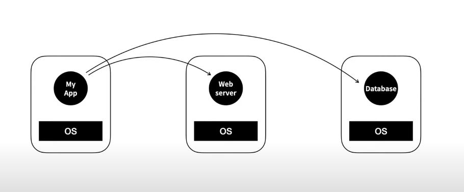
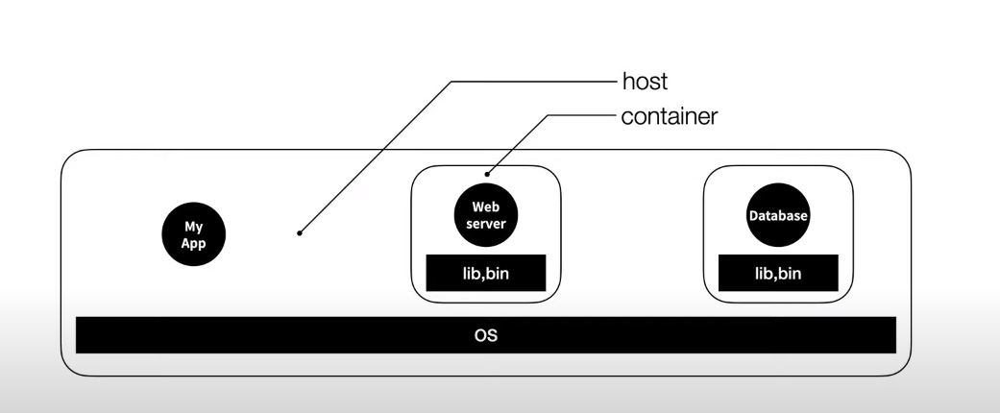
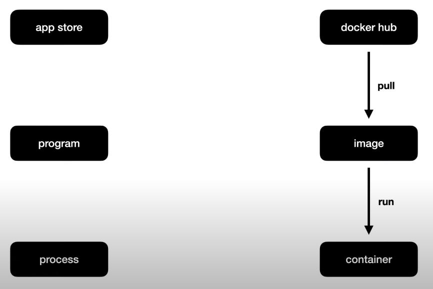
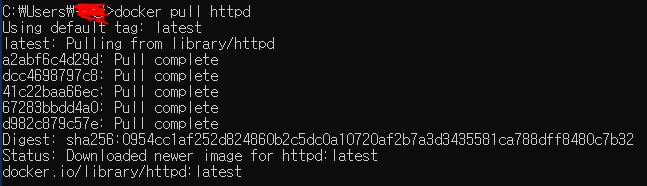
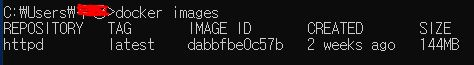
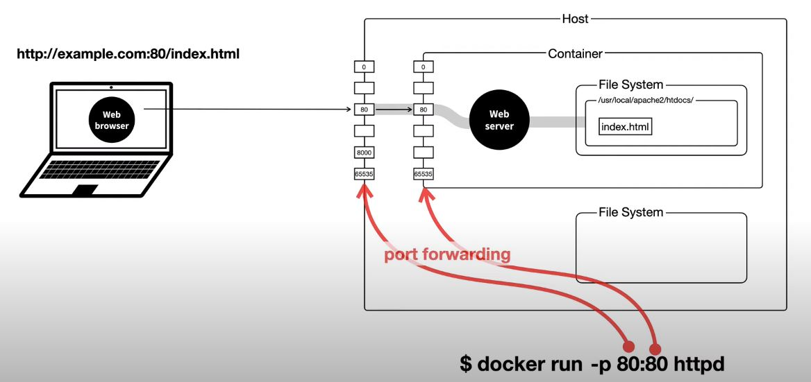
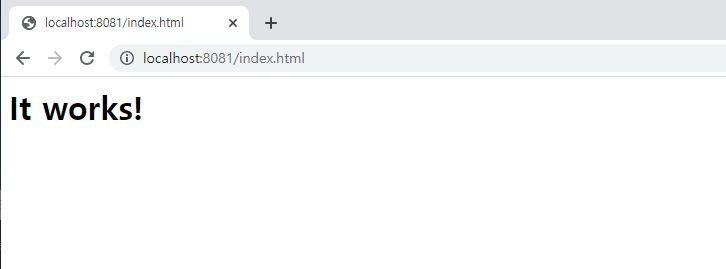

작년부터 궁금했던 도커라는 녀석을 공부해 보기로 했다.  
무작정 유튜브에 도커를 쳐보니 생활코딩 유튜브 채널에 도커 입문용 강의가 있더라... 감사합니다!

### 도커를 사용하게 된 배경

어떠한 어플리케이션을 개발할 때 웹서버와 데이터베이스가 필요하다. 그런데 만일 웹서버에 맞는 운영체제와 데이터베이스에 맞는 운영체제가 다른 경우 가장 이상적인 그림은 아래와 같을 것이다.



각각의 역할을 하는 컴퓨터를 세 대를 두고 어플리케이션에서 다른 두 대의 컴퓨터로 네트워크 통신을 한다면 하나의 컴퓨터에서 여러 운영체제를 커버해야할 때 큰 고민 없이 개발할 수 있을 것이다.  
하지만 비용적으로 문제가 생긴다.

VirtualBox라는 가상 머신을 이용해 특정 운영체제 위에 다른 운영체제를 깔고 사용하는 방법도 있다. 그런데 이 방법은 용량적인 문제와 실행 속도에 문제가 생길 수 있다.

### 도커에서의 호스트와 컨테이너



하나의 운영체제 위에 내 어플리케이션이 있고 웹서버와 데이터베이스가 있지만 웹서버와 데이터베이스는 컨테이너라는 격리된 공간에서 해당 앱을 실행하는 lib와 실행파일 bin과 같은 것들만 포함되어 있다.  
이런 구조라면 동일한 운영체제를 공유하기 때문에 다른 운영체제를 설치할 필요도 없고 속도가 느려지는 부분도, 용량 절약도 보완이 된다.  
호스트라는 주인 공간에 컨테이너들이 규격에 맞게 박싱되어 존재하고, 호스트는 그 박스 안에서 어떤 복잡한 일들이 일어나는지 신경 쓰지 않아도 되는 공간을 컨테이너라 부르는 것 같다.

도커와 같은 컨테이너 기술은 리눅스 운영체제의 기술이다.  
하지만 리눅스를 설치하지 않아도 도커가 알아서 가상머신을 만든 뒤 그 위에 리눅스 운영체제를 설치해 준다. 리눅스 기반에서 개발을 한다면 도커가 가상머신을 설치하지 않고 바로 컨테이너 기술을 사용하기 때문에 윈도우에서 도커를 사용하는 것과는 성능 차이가 있다.

### 윈도우에서 도커 설치 방법

1. 도커 사이트로 가서 데스크탑용 도커 파일을 다운  
   [데스크탑 도커 파일 다운로드](https://www.docker.com/products/docker-desktop)
2. 설치가 끝나고 윈도우를 재시작
3. 도커 아이콘을 클릭했을 때 WSL2 경고창이 뜨면 아래 사이트로 가서 스텝 4단계까지 진행  
   [리눅스 커널 업데이트 패키지 다운로드](https://docs.microsoft.com/ko-kr/windows/wsl/install-manual#step-4---download-the-linux-kernel-update-package)
   - WSL이란?
     > 윈도우 서브 시스템 포 리눅스로 윈도우10 운영체제에서 리눅스 운영체제의 쉘과 시스템을 사용할 수 있도록 지원해 주는 기능이다.
4. 명령프롬프트에서 `docker images`를 실행했을 때 에러가 안 뜨면 도커가 무사히 설치된 것

### 도커와 관련된 개념들



도커라는 세계에는 도커 허브라는 저장소가 존재한다.  
유저가 앱스토어에서 특정 프로그램을 다운 받고 실행을 시키는 순서를 도커와 비교해 보면 용어를 기억하기 쉽겠다.  
도커 허브에서 특정 이미지를 풀 받고 풀 받은 이미지를 런하게 되면 그 이미지가 컨테이너가 된다. 그리고 컨테이너가 실행되면서 컨테이너 안에서 실행되도록 설정해둔 프로그램이 실행된다.

### 도커 기본 명령어 살펴보기

명령 프롬프트 창에 docker images 를 쳐보면 풀 받은 이미지가 없기 때문에 빈 리스트가 나온다.

```
docker images
```


다운 받고자하는 이미지를 docker pull {이미지명} 를 입력하면 아래와 같은 로그가 뜨고

```
docker pull {image name}
```



다시 docker images 를 해보면 풀 받은 이미지 목록이 떠있다.



실행 중 도커를 확인하려면 아래 명령어로 리스트 조회가 가능하다.  
(이제부터 여기서 말하는 이미지는 곧 컨테이너가 된다)

```
docker ps
```

다운 받은 이미지를 실행시키려면 아래 명령어로 특정 이미지 실행이 가능하다.

```
docker run {image}
```

다운 받은 이미지에 name을 붙여서 실행시키려면 아래 명령어로 특정 이미지 실행이 가능하다.

```
docker run --name {imagename} {image}
```

### 도커를 이용해 웹 서버 사용법

- 로컬 컴퓨터에 직접 웹 서버 설치한 경우

  

웹브라우저에서 서버에 요청을 할 때 서버는 0부터 65535포트 중 80번 포트를 요청 게이트로 설정해 놨다고 가정하자.  
http://example.com:80/index.html uri로 웹서버에게 요청을 하면 대기 중이던 웹서버는 80번 포트를 통해 index.html을 찾는다. index.html 코드를 웹브라우저에게 전달하면 /index.html 요청에 대한 과정이 끝난다.

- 도커를 이용해 웹 서버를 설치한 경우
  

도커를 이용해 웹서버를 설치하면 이 웹서버는 컨테이너 안에 설치가 된다. 그리고 이 컨테이너가 설치된 운영체제를 도커 호스트라고 부른다.  
컨테이너와 호스트는 독립적인 실행 환경이기 때문에 각각 따로 포트들을 가지고 있다. 그렇기 때문에... 따로 포트 연결을 해주지 않으면 끊어져있기 때문에 `포트포워딩`을 해줘야 한다.

```
docker run -p 8081:80 httpd
```

이미지를 실행할 때 호스트의 포트와 컨테이너의 포트를 기재해준다. 앞에 8081이 호스트의 포트이고 뒤에 80이 컨테이너의 포트이다.



### 도움 받은 자료들

- https://www.youtube.com/watch?v=Ps8HDIAyPD0&list=PLuHgQVnccGMDeMJsGq2O-55Ymtx0IdKWf
