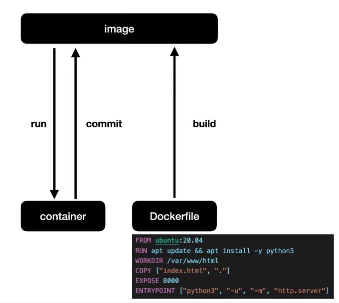
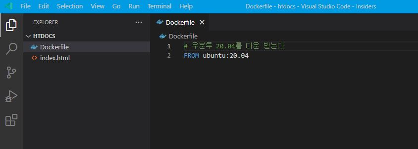
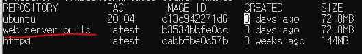

도커 허브에서 내려 받은 이미지를 다운 받아 컨테이너로 만들어 런을 시켜보고 나니 나도 도커 허브에 내 이미지를 올려보고 싶다는 생각이 들었다.

### 도커 이미지 만드는 법 두 가지



1. 컨테이너에서 커밋하여 이미지 만들기

   - 내 컨테이너의 진행 상황을 커밋하여 이미지를 만드는 방법은 **백업**의 개념과 가깝다.

2. **도커 파일**을 만들어 **빌드**하여 이미지 만들기

   - 도커 파일로 만드는 이미지는 구체적으로 시간 순서에 따라 이미지를 **생성**하는 개념에 가깝다.

### 웹 서버 이미지를 도커 파일로 만들기



1.  도커 파일 작성

    - Dockerfile이라는 약속된 도커 파일을 생성 후 컨테이너 생성 환경을 파일에 적어준다.

      ```js
      FROM unbuntu:20.04
      ```

2.  도커 파일 빌드

    - 생성된 도커에 태그명으로 web-server-build를 명명했고, 도커 파일이 있는 디렉토리에서 앞으로의 작업을 할 예정이므로 현재 디렉토리 . 를 가리킨다.

      ```
        > docker build -t web-server-build .
      ```

    - 도커 web-server-build 이미지 생성 확인

      - 아래 명령어를 실행하면 만들어진 이미지 목록 조회가 가능하다.

        ```
          > docker images
        ```

        

3.  도커 파일 작성 완료

    ```js
    FROM ubuntu:20.04
    RUN apt update && apt install -y python3
    WORKDIR /var/www/html
    COPY ["index.html", "."]
    CMD ["python3", "-u", "-m", "http.server"]
    ```

    - 우분투 20.04 환경을 세팅한다
    - apt update 하고 python3를 설치한다 (\*run 명령어는 빌드 시점에 실행)
    - 작업 디렉토리를 생성한다 (없다면 만들어서 생성한다)
    - 호스트에 있는 index.html 파일을 workdir 디렉토리에 복사한다
    - cmd 명령어로 파이썬 웹서버를 실행한다 (\*cmd 명령어는 컨테이너 시점에 실행)

4.  도커 파일 빌드 후 만든 이미지 실행

    ```
      > docker build -t web-server-build .;
      > docker rm --force web-server;
      > docker run -p 8888:8000 --name web-server web-server-build
    ```

    - 도커 파일을 해당 디렉토리에서 web-server 태그를 붙여 빌드한다
    - web-server 태그가 있다면 삭제하고 새로 생성한다
    - web-server-build 이미지를 바탕으로 web-server 컨테이너를 생성해 호스트 8888 포트를 컨테이너 8000 포트와 연결해 실행

위 방법을 이용하면 create-react-app 을 이용해 리액트 빌드 파일을 도커 컨테이너에서 실행한 파이썬 서버에 올려볼 수도 있겠다. 꼭 해보자.

### 출처

- https://www.youtube.com/watch?v=0kQC19w0gTI
