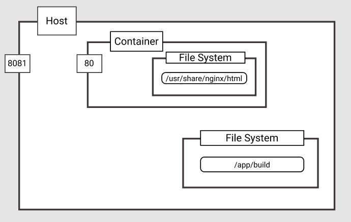

도커 이미지 만드는 법을 배웠으니 사이드 프로젝트로 만들고 있는 리액트 어플리케이션을 도커 이미지로 nginx에 배포해 보자!

### 1. 준비물 확인

- 리액트 어플리케이션 (create-react-app으로 만들어서 해당 템플릿에 `npm run build` 명령어를 통해 정적 서버에 올릴 build 명령어가 내장되어있다)
- 도커 설치 완료

### 2. 도커 파일 작성

배포용으로 도커 파일을 하나 더 두고자하여 아래와 같이 도커 파일을 작성했다.  
파일명 : Dockerfile_Production

```dockerfile
# stage1
FROM node:14.17.5
WORKDIR /app
COPY package.json .
RUN npm install
COPY . .
RUN npm run build

# stage2
FROM nginx:alpine
COPY nginx.conf /etc/nginx/conf.d/default.conf
COPY --from=builder /app/build /usr/share/nginx/html
EXPOSE 80
CMD ["nginx", "-g", "daemon off;"]

```

배포 stage는 총 두 단계이다.  
stage1에서는 리액트 어플리케이션을 빌드하고,  
stage2에서 리액트 build 폴더를 nginx html 폴더에 복사하여 넣어준다. 그리고 nginx 서버 실행!

내가 만든 도커 환경을 그림으로 표현하면 아래와 같을 것이다.



#### stage 1 설명

```dockerfile
FROM node:14.17.5 as builder
WORKDIR /app
COPY package.json .
```

리액트 어플리케이션이 실행되기 위해선 node 환경이 필요하므로 내 로컬 환경 버전과 동일한 노드 버전을 도커 호스트에 설치했다.  
호스트에 /app 경로를 만들어 그곳에 package.json을 복사했다.

- package.json을 먼저 복사한 이유
  - 도커 이미지는 각 명령어마다 레이어층을 만든다. 그렇기 때문에 도커 이미지를 만들 때, 해당하는 명령어 레이어에 변화가 없다면 캐싱 기능을 사용할 수 있다!

```dockerfile
RUN npm install
COPY . .
RUN npm run build
```

package.json에 수정사항이 있다면 npm install로 노드모듈들을 재설치 후 로컬에 있는 모든 파일을 호스트의 /app 폴더에 전부 카피한다. 그리고 여기서
**`.dockerignore` 파일에 반드시 `node_modules`를 기재해야 전체 파일 카피할 때 시간을 절약**할 수 있다.

#### stage 2 설명
