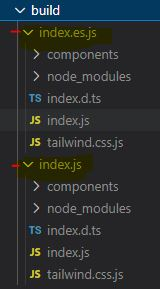
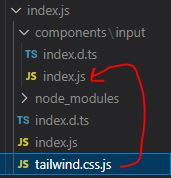

사내에서 공통 모듈만 모아둔 라이브러리를 Storybook을 이용해 만들었는데 급하게 만들다보니 번들하고 배포하는 과정에서 아쉬운 부분이 보여 사이드 프로젝트를 진행하며 조금 더 공부해 본 내용을 정리하려고 한다.

**개발 환경 버전**  
node v14.17.5  
npm v.6.14.14  
webpack 5

## 1. Storybook을 사용하려는 이유

1. 자주 사용하는 코드만큼은 **문서화**시켜놓고 싶다.  
   코드에 대한 간략한 명세서가 있다면 다른 사람이 해당 코드를 봤을 때 이해가 쉬울 것이다.

2. 자주 사용하는 코드는 **공통 라이브러리**로 묶어놓고 싶다.  
   프로젝트의 개수는 쌓여가지만 그 안에 활용하는 코드 및 기능은 동일한데 이 코드들이 프로젝트별로 각각 다르다면 유지보수할 때 괴로우니 미리 묶어놓자.

3. 코드 뿐만 아니라 **디자인 또한 모듈화**시키고 싶다.  
   팀 특성상 프론트개발자가 곧 디자이너이기도해서 프론트의 코드와 디자인이 일체화되었으면 좋겠다는 생각에 도입했는데 사실 이 부분은 유연하게 가져가도 좋을 것 같다. (프로젝트마다 디자인이 작게 작게 변할 수도 있으니까) 당장 급한 것은 기능들을 모듈화시키는 것이고 디자인적인 부분에서 공통화시킬 개념은 색상값 정도로 생각하고 있다.

## 2. simple-design-kit✨ 초기 설정

simple-design-kit 프로젝트는 컴포넌트 명세서 & 공통 모듈들을 라이브러리화시키는 용도이므로 모든 종속성 설치 라이브러리에 대해 짚고 넘어가며 만들기 위해 CRA 로 만들지 않았다.

### package.json 파일 만들기

> package.json ?  
> 현재 프로젝트에 대한 정보(이름, 버전, 설명, 저자, 라이센스 종류 등)와 패키지 매니저(npm, yarn)를 통해 설치한 의존성 모듈들로는 무엇이 있는지 관리해 주는 파일이다.

```sh
npm init --yes
```

```json{numberLines: true}
{
  "name": "simple-design-kit",
  "version": "0.0.1",
  "description": "front lib for design component kit",
  "main": "build/index.js",
  "module": "build/index.es.js",
  "files": [
    "build"
  ],
  "scripts": {
    "build": "rollup -c rollup.config.js",
  },

  ...
}
```

- name : 라이브러리 이름 지정
- version : 배포 버전
- main : 빌드시킨 결과물은 build 폴더에 담을 예정이고 cjs 포맷으로 빌드된 index를 메인 파일로 사용할 예정이다.

  type:module을 설정하면 es 포맷으로도 외부에서 불러올 수 있으나 이 경우 package.json 의 역할은 프로젝트가 아닌 모듈 명세서로만 한정된다. 필자는 하나의 package.json으로 스토리북도 운용할 예정이므로 type:module 옵션 설정을 하지 않았고 해당 package.json으로 라이브러리 배포 시 외부에서 읽어들일 수 있게 cjs 포맷을 메인 엔트리로 잡았다.

## 3. 컴포넌트 구성에 필요한 설치

npm 혹은 yarn 패키지 매니저를 통해서 package.json에 내가 만들고자하는 프로젝트에 필요한 의존성 모듈(라이브러리)들을 설치할 수 있는데 이때 `-dev`, `-D` 옵션을 추가할 수 있다. 이 옵션을 추가하면 프로젝트의 개발 모드에서만 설치되는 `devDependencies` 리스트로 기재되어 실제 배포할 때 가벼운 버전의 프로젝트로 빌드할 수 있다.  
(내가 설치하는 라이브러리가 개발모드에서만 필요한지 배포모드에서도 필요한지 꼭 체크해서 날씬한 배포 프로젝트를 만들자)

**스토리북은 프론트 프레임워크 위에서 구동하는 UI 구성 요소용 개발 환경이다.** 리액트를 예로 들자면 리액트 어플리케이션이 localhost:3000 에서 구동할 때 스토리북은 localhost:8000에서 단독으로 실행될 수 있다. 하지만 리액트도, 앵귤러도, 뷰도 없는 빈 프로젝트 위에서는 만들어지지 않는다. 그러므로 스토리북을 얹을 프론트 작업물이 선행으로 세팅되어야 한다.

```sh
npm install react react-dom @types/react typescript -D
```

- react : 리액트 환경에서 사용할 컴포넌트가 필요하므로 리액트 라이브러리를 설치.
- react-dom : 리액트 라이브러리와 한쌍을 이루는 라이브러리로, 리액트를 위해 존재하는 돔의 진입 포인트 역할을 하는 라이브러리 설치.
- @types/react : 컴포넌트 코드들을 타입스크립트로 개발할 것이므로 리액트의 타입을 불러오는 라이브러리 설치.
- typescript : 타입이 입혀진 컴포넌트를 개발할 예정이므로 타이핑 언어 설치.

```json{numberLines: true}
// tsconfig.json
{
  "compilerOptions": {
    "declaration": true,
    "declarationDir": "build",
    "target": "es5",
    "lib": ["dom", "dom.iterable", "esnext"],
    "skipLibCheck": true,
    "esModuleInterop": true,
    "allowSyntheticDefaultImports": true,
    "strict": true,
    "module": "esnext",
    "moduleResolution": "node",
    "resolveJsonModule": true,
    "jsx": "react",
    "typeRoots": ["./types"]
  },
  "include": ["components", "types"]
}
```

### tsconfig 설정

타입핑된 코드는 개발자 입장에서 친절하고 유용하지만 결국은 브라우저가 해석하기 위한 자바스크립트 코드로 트랜스파일되어야 한다. `compilerOptions` 에서 트랜스파일을 어떤 설정값으로 할지 세팅할 수 있고 `include` 에 들어간 값들은 타입스크립트의 트랜스파일 대상 타겟이 된다. 타입을 지원하지 않는 써드파티 라이브러리의 경우 내가 직접 타이핑을 해줘야할 수도 있고 내가 만든 라이브러리 모듈에 특정 타입 코드가 반드시 들어가야하는 경우 활용하기 좋다.

`compilerOptions` 에 설정한 옵션값들을 하나씩 설명하면 다음과 같다.

**declaration**: (중요✔) 해당하는 코드의 .d.ts 파일을 생성한다. 빌드시켜 외부에서 사용할 컴포넌트들을 편집기에서 클릭하면 타입 정보 파일이 보였으면 하여 true로 설정했다.  
**declarationDir**: (중요✔) 프로젝트를 빌드시킬 폴더 경로를 지정한다.  
**target**: 트랜스파일될 자바스크립트 표준 규격 대상 버전 지정한다. 구버전의 브라우저도 지원할 수 있도록 es5로 지정했다.  
**lib**: target에서 지정한 자바스크립트 표준 규격의 버전에 따라 기본값이 설정된다. 그런데 작성한 코드들이 es6 버전에만 나오는 문법들이 있으므로 es6 기본값들을 넣어줬고 import 문법을 사용하므로 esnext를 추가했다.  
**skipLibCheck**: lib에 대한 타입 검사까지는 하고 싶지 않아 true로 설정했다.  
**esModuleInterop**: CommonJS와 ES 모듈 간의 상호 운용성을 활성화한다. true로 설정하면 ES6 모듈 사양을 준수해 CommonJS 모듈을 가져올 수 있게 된다.  
**allowSyntheticDefaultImports**: 트랜스파일될 코드가 module.exports.default 형식이 아니라도 허용시킨다.  
**strict**: 모든 엄격한 타입-체킹 옵션을 활성화했다.  
**module**: 모듈을 위한 코드 생성 타입을 설정한다. 최신 문법까지 지원하는 esnext 타입으로 설정했다.  
**moduleResolution**: 생성되는 코드들을 누가 해석하는지 지정한다. node로 설정했다.  
**resolveJsonModule**: import 시키는 모듈들 중 json 파일 형식을 허용한다.  
**jsx**: jsx 속성을 활성화하면 프로젝트에서 .tsx 파일을 사용할 수 있다.  
**typeRoots**: 유형 정의를 포함할 폴더 목록을 지정한다. 타입핑이 되어 있지 않은 라이브러리의 경우 이곳에 타입을 기재해 준다.

또한 작성한 컴포넌트의 interface나 type들을 export 시켜주지 않으면 빌드할 때 에러가 나니 꼭 기재한 타입들은 export 시켜주자.

### Storybook 설정

```bash
npm install -D @storybook/react @babel/core babel-loader
npm install -D @storybook/addon-links @storybook/addon-essentials @storybook/addon-interactions @storybook/addon-postcss
npm install -D @storybook/manager-webpack5 html-webpack-plugin
```

- @storybook/react : 리액트 기반의 스토리북을 실행시켜주는 라이브러리.
- @babel/core : es6 이상의 최신 문법을 es5 이하의 구 버전 문법으로 변환해 주는 라이브러리.
- babel-loader : 바벨 및 웹팩을 사용해 자바스크립트 파일 변환시켜주는 라이브러리.
- @storybook/addon-links : 스토리북 내에서 링크 이동을 지원하는 스토리북 애드온.
- @storybook/addon-essentials : 스토리북에서 자주 사용하는 필수 애드온 모음집. (action, backgrounds, controls, docs, toolbars, viewport)
- @storybook/addon-interactions : 스토리북에서 컴포넌트 상호작용 및 테스트를 시각적으로 디버깅하도록 도와주는 애드온.
- @storybook/addon-postcss : 만들어진 스토리에 postcss 전처리기를 적용해주는 애드온.

  **설치한 스토리북 버전이 6.x인 경우 추가 설치 필요**

  - @storybook/manager-webpack5 : 스토리북 정적 파일을 빌드시키는 @storybook/core-server가 사용하는 빌더 (webpack5로 구현됨)
  - html-webpack-plugin : 웹팩 플러그인으로, 스토리북의 빌더가 html 파일을 생성할 때 단순화시켜주는 라이브러리이다.

**스토리북 애드온 연결**

```js{numberLines: true}
// .storybook/main.js

module.exports = {
  stories: ["../**/*.stories.mdx", "../**/*.stories.tsx"],
  addons: [
    "@storybook/addon-links",
    "@storybook/addon-essentials",
    "@storybook/addon-interactions",
    "@storybook/addon-postcss",
  ],
};
```

스토리북으로 사용할 대상 파일의 확장자를 설정해주고 앞서 설치한 애드온들을 연결해 준다.

**스토리북 preloading 될 때 설정**

```js{numberLines: true}
// .storybook/preview.js

import "../tailwind.css"; // tailwindcss 추가

export const parameters = {
  actions: { argTypesRegex: "^on[A-Z].*" }, // on***으로 시작하는 함수는 액션 애드온에 연결
  controls: {
    matchers: {
      color: /(background|color)$/i,
    },
  },
};
```

### tailwindcss 설정

tailwindcss는 클래스 이름에 대한 정보를 js 파일로 스캔 후 해당 정보에 맞는 스타일을 생성 후 정적 css파일에 작성하는 방식으로 엘리먼트에 스타일을 적용한다.

```bash
npm install -D tailwindcss postcss autoprefixer
```

- tailwindcss : ui 인터페이스를 빠르게 스타일링해 주는 css 프레임워크.
- postcss : 스타일들을 js 플러그인으로 변환해 주는 라이브러리.
- autoprefixer : tailwindcss 구문의 접두어를 해석해 주는 라이브러리.

```js{numberLines: true}
// tailwind.config.js

module.exports = {
  content: ["./components/**/*.{html,js,jsx,ts,tsx}"],
  darkMode: false, // or 'media' or 'class'
  theme: {
    extend: {},
  },
  variants: {
    extend: {},
  },
  plugins: [],
};
```

tailwind.config.js 설정 파일에서 content 부분에 tailwindcss를 적용할 대상 파일 경로를 추가해 줬다.

```js{numberLines: true}
// postcss.config.js

module.exports = {
  plugins: {
    tailwindcss: {},
    autoprefixer: {},
  },
};
```

```css{numberLines: true}
/* tailwind.css */

@tailwind base;
@tailwind components;
@tailwind utilities;
@tailwind forms;
```

postcss.config.js 설정 파일을 통해 tailwindcss를 js 파일로 변환시켜주고 tailwind 접두어를 해석한다.

## 4. 빌드에 필요한 설치

앞으로 만들 컴포넌트 모듈들을 번들시킬 도구로 rollup.js를 선택했다.  
**Rollup**은 Webpack과 유사한 모듈 번들러지만 ES6 모듈 형식으로 빌드 결과물을 출력할 수 있다는 장점이 있다. 그리고 이걸 그대로 라이브러리나 패키지로 불러와 사용이 가능하다. (다만 이 경우에는 package.json에 type:module 반드시 기재해 줘야한다)  
또한 진입점을 여러개로 나눌 수 있어 es모듈 방식과 commonjs모듈 방식 두 가지로 빌드가 가능하다. 결정적으로 Rollup은 Code splitting 면에서도 성능이 우수해 중복된 파일 제거에 강점이 있어 **최소한의 서드파티로 라이브러리를 만들 수 있다**고 판단해 Rollup을 선택했다.

### Rollup 설정

```bash
npm install -D rollup rollup-plugin-typescript2
npm install -D rollup-plugin-postcss @rollup/plugin-commonjs @rollup/plugin-node-resolve
npm install -D rollup-plugin-peer-deps-external
```

- rollup : 모듈들을 번들시켜주는 rollup 라이브러리.
- rollup-plugin-typescript2 : 번들할 때 각 코드들의 타입들을 만들어주는 라이브러리.
- rollup-plugin-postcss : postcss라는 css 후처리기로 tailwindcss 프레임워크가 웹앱에 정적 css 파일로 작성되도록 도와주는 rollup 전용 postcss 플러그인.
- @rollup/plugin-commonjs : CommonJS 모듈을 ES6으로 변환하여 rollup 번들에 포함할 수 있도록 하는 플러그인.
- @rollup/plugin-node-resolve : node_modules에서 타사 모듈을 사용하기 위해 노드 해결 알고리즘을 사용하여 모듈을 찾는 플러그인.
- rollup-plugin-peer-deps-external : rollup 번들에서 peerDependencies에 기재된 라이브러리들은 자동으로 제외시켜주는 라이브러리.

나는 rollup 설정 파일을 아래와 같이 사용했다.

```js{numberLines: true}
// rollup.config.js
import resolve from "@rollup/plugin-node-resolve"
import peerDepsExternal from "rollup-plugin-peer-deps-external"
import postcss from "rollup-plugin-postcss"
import { terser } from "rollup-plugin-terser"
import typescript from "rollup-plugin-typescript2"
import commonjs from "@rollup/plugin-commonjs"

import pkg from "./package.json"
const tailwindcss = require("tailwindcss")

export default {
  input: "./index.ts",
  output: [
    {
      dir: pkg.main, // "build/index.js"
      format: "cjs",
      preserveModules: true,
    },
    {
      dir: pkg.module, // "build/index.es.js"
      format: "es",
      preserveModules: true,
    },
  ],
  plugins: [
    peerDepsExternal(),
    postcss({
      plugins: [
        tailwindcss("./tailwind.config.js"),
        require("autoprefixer"),
        require("cssnano")({ preset: "default" }),
      ],
    }),
    resolve(),
    typescript({
      tsconfig: "./tsconfig.json",
    }),
    commonjs({
      include: ["node_modules/**"],
    }),
    terser(),
  ],
}
```

**rollup 파일 i/o 설정**

- 만들어진 모든 컴포넌트들은 index.ts 파일에서 export 시키므로 rollup의 엔트리 경로를 "./index.ts"로 잡았다.
- 빌드시킨 컴포넌트들은 es, cjs 형식으로 빌드되는데 해당 경로는 package.json에서 불러오도록 설정했다.
- 각 빌드 엔트리 포인트에 preserveModules 옵션값을 추가해 기존 폴더 구조와 동일하게 빌드시켰다. 이렇게 기존 폴더 구조로 배포하면 아래 두 가지 방식으로 import하여 사용할 수 있다.

```js{numberLines: true}
import { input } from "simple-design-kit"; // option 1
import { Input } from "simple-design-kit/build/index.js/components/input"; // option 2
```

**rollup 플러그인 설정**

- peerDepsExternal : 내가 만든 해당 라이브러리의 의존성 모듈만 기재해주고 실제로 배포하는 폴더에는 해당 라이브러리는 배제해 준다.
- postcss : 빌드시킨 컴포넌트들은 tailwindcss가 입혀져있어 tailwindcss를 css로 변환해 배포된 컴포넌트에 스타일을 적용했다.
- resolve : 컴포넌트 작업 중 dayjs 등 써드파티 라이브러리를 사용하게 되면 해당 라이브러리의 모듈을 찾아주도록 설정했다.
- typescript : 빌드된 컴포넌트들은 tsconfig.json 설정 파일에 따라 타이핑되어 배포된다.
- commonjs : 나는 cjs 뿐만 아니라 es 형식의 빌드도 했기 때문에 commonjs 포맷을 es 포맷으로 바꿔주는 플러그인을 추가했다.
- terser : 빌드 결과 코드들의 압축시켜주는 플러그인을 추가했다.

현재까지 작업 폴더의 구조는 아래와 같다.  
루트에 설정 파일과 엔트리 index 파일을 작성하고, 배포시킬 컴포넌트들은 components 폴더 안에 넣어놨다.

```bash
├── build/
│   ├── index.es.js/
│   └── index.js/
├── components/
│   ├── button
│   └── input
├── types/
├── index.ts
├── rollup.config.js
├── tailwind.config.js
├── postcss.config.js
├── tsconfig.json
├── tailwind.css
└── package.json
```



rollup으로 빌드하면 build 폴더가 만들어지면서 하위에 index.es.js 폴더와 index.js 폴더가 생성된다.  
이 폴더들은 원래의 구조를 그대로 가져다 빌드시켜놔서 결과물을 보기에도 편하고 외부에서 라이브러리를 사용할 때 전체 모듈을 import 시키는 것이 아닌 특정 모듈만 불러올 수 있어 tree-shaking 작업도 가능해졌다!



index.js 폴더 안의 input/index.js를 열어보면 postcss로 변환시킨 tailwind.css.js를 호출 중이고 tailwind.css.js를 열어보면 해당 컴포넌트 스타일링을 위해 내가 사용한 tailwindcss class에 해당하는 css만 기재되어있다.

## 5. vercel 배포

배포까지 완료된 작업물은 [simple-design-kit](https://simple-design-kit.vercel.app/)에서 확인할 수 있다.

## 6. 요약

- 스토리북을 이용해 공통 컴포넌트를 개발 및 관리할 수 있다.
- 스토리북을 UI 컨벤션으로만 활용할 수도 있는데 이때 index 파일에 배포용 컴포넌트만 따로 export 시키면 된다.
- rollup을 이용해 export 된 모듈들만 번들시킬 수 있다.
- 외부에서 내가 작성한 라이브러리의 타이핑을 보기 위해선 번들할 때 tsconfig 설정을 반드시 해 줘야한다.
- 기본적으로 스토리북은 웹팩으로 빌드되고, v6.2 부터는 웹팩5를 지원하는데 `npx sb`와 같은 명령어가 아닌 수동으로 스토리북을 설치하는 경우 웹팩 관련 추가 설치 작업이 필요하다
- package.json 파일에 `type:module` 옵션을 주면 es 모듈로도 외부에서 불러올 수 있다. 하지만 기본적으로는 cjs 모듈로 외부에서 읽어들인다.
