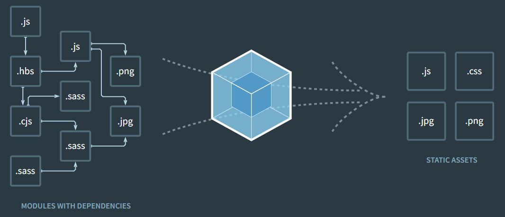

회사에서 프로젝트 용량 줄이기 작업을 하면서 내가 만든 프로젝트의 번들링에 대한 이해도가 부족하다는 생각이 문득 들었다. CRA (Create Reat App) 라는 리액트 보일러 프로젝트 명령어로 주로 프로젝트를 만들어서 활용했는데 이 명령어 하나면 웹팩과 바벨이 자동으로 포함되어 프로젝트 환경을 구성해 주기 때문이다.

이번에는 웹팩과 바벨로 리액트 프로젝트를 어떻게 구성할 수 있는지 CRA 없이 환경 세팅을 해 보자.

### 웹팩과 바벨

#### 웹팩

웹팩이란 웹페이지를 띄우기 위해 사용되는 모든 자원들을 하나의 자바스크립트 코드로 번들링해 주는 라이브러리이다. 그림과 같이 자원들에는 js, css, image와 같은 것들이 있다.



그림과 같이 entry js 파일부터 시작해 이 파일이 참조하는 모듈 A를 추적하고 모듈 A가 참조하는 다른 모듈 B를 추적하는 식으로 꼬리 물기와 같이 이어진 의존성을 조사해 깔끔하게 하나로 묶인 js 파일을 생성해 준다.

웹팩의 장점을 정리해 보자면 아래와 같다.

1. 여러 파일의 자바스크립트 코드를 압축하여 로딩하기 때문에 화면 로드 시 자원을 여러번 요청하지 않고 한번에 받아올 수 있어 네트워크 요청을 최소화한다.
2. 모듈 단위로 개발이 가능해 가독성과 유지보수가 쉽다.
3. 최신 자바스크립트 문법을 지원하지 않는 브라우저에서 사용 가능한 문법으로 쉽게 변환시켜준다. 이부분은 바벨과도 연관이 깊다.

#### 바벨

다양한 브라우저들의 호환성을 지원하기 위해 사용되는 자바스크립트의 컴파일러이다.  
바벨은 구형 문법 자바스크립 코드를 만들어내기 위해 파싱 -> 변환 -> 출력의 단계를 거친다.

1. 파싱 : 코드를 읽고 추상 구문 트리로 변환
2. 변환 : 추상 구문 트리를 해당 문법 코드로 변경
3. 출력 : 변경된 결과물을 출력

2번 변환 단계를 담당하는 것이 바로 바벨 플러그인이다. 플러그인은 어떤 코드를 어떻게 변환할지에 대한 규칙을 정의한다. 그리고 플러그인들을 목적에 따라 묶어놓은 세트를 preset(프리셋)이라고 한다.

현 포스팅에서 코드를 변환하는 역할은 웹팩이 담당하기 때문에 여기서 사용되는 babelrc 파일의 역할은 babel에게 '설치한 라이브러리들을 사용할 것이다' 알려주기 위한 용도로 쓰인다.

```babelrc
// .babelrc
{
  "presets": ["@babel/preset-env", "@babel/preset-react"],
  "plugins": [],
}
```

### 세팅 시작

### 도움 받은 글

[CRA 없이 리액트 설치](https://medium.com/@_diana_lee/cra%EC%97%86%EC%9D%B4-%EB%A6%AC%EC%95%A1%ED%8A%B8-%ED%94%84%EB%A1%9C%EC%A0%9D%ED%8A%B8-%EC%8B%9C%EC%9E%91%ED%95%98%EA%B8%B0-feat-%EC%9B%B9%ED%8C%A9-%EB%B0%94%EB%B2%A8-74f5bc3c5da1)
